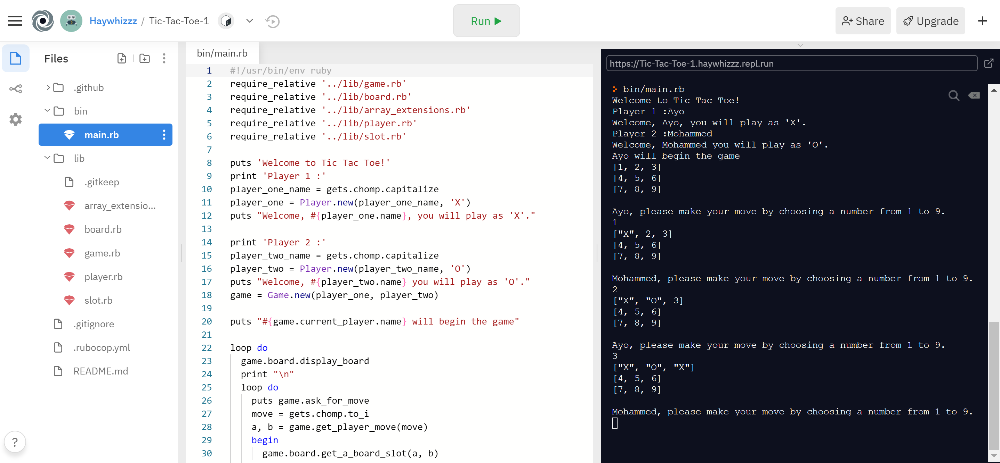

# Tic-Tac-Toe
In this project, We built a Tic Tac Toe game with Ruby. The main goal was to put into practice the main concepts of Object Oriented Programming. Particularly, classes and access to their attributes.

## How To Run

- Clone [Tic Tac Toe](https://github.com/Haywhizzz/Tic-Tac-Toe)
- Open Folder
- Run bin/main.rb
- Enjoy the game!

## How To Play

- Players take turns playing
- First turn — Player 1
- Player 1 places their token (X) in only 1 square of their choice
- Puts player 1's name and will tell that their turn
- Second turn — Player 2
- Player 2 places their token (O) in only 1 square of their choice, except they can’t touch the square that Player 1’s token already fills
- Puts player 1's name and will tell that their turn
- 3rd turn- Player 1 …. and the cycle continues until a player wins or there’s a tie game
- There are 8 winning combinations: Top row, Middle row, Bottom row, Left column, Middle column, Right column, Left diagonal, and Right diagonal
- There’s a draw when the entire board is filled with X’s and O’s but no winning combinations can be found

## Built With

- Ruby
- VS Code
- Windows

## Live Demo Link
- [Live](https://repl.it/@Haywhizzz/Tic-Tac-Toe-1#bin/main.rb)

👤 **Author**

- Github: [@mcihadkurel](https://github.com/mcihadkurel)
- Twitter: [@mece_ka](https://twitter.com/mece_ka)
- LinkedIn: [@muhammed](https://www.linkedin.com/in/muhammed-cihad-8187581a8/)

👤 **Author**

- Github:[@Haywhizzz](https://github.com/Haywhizzz)
- Twitter:[@Haywhizzz](https://twitter.com/Haywhizzz)
- Linkedin:[@Haywhizzz](https://www.linkedin.com/in/oyeleke-ayomide-b962421a6/)

## 🤝 Contributing

Contributions, issues and feature requests are welcome!

Feel free to check the [issues page](issues/).

## Show your support

Give a ⭐️ if you like this project!

## Acknowledgments

- Hat tip to anyone whose code was used
- Inspiration
- etc

## 📝 License

This project has no license